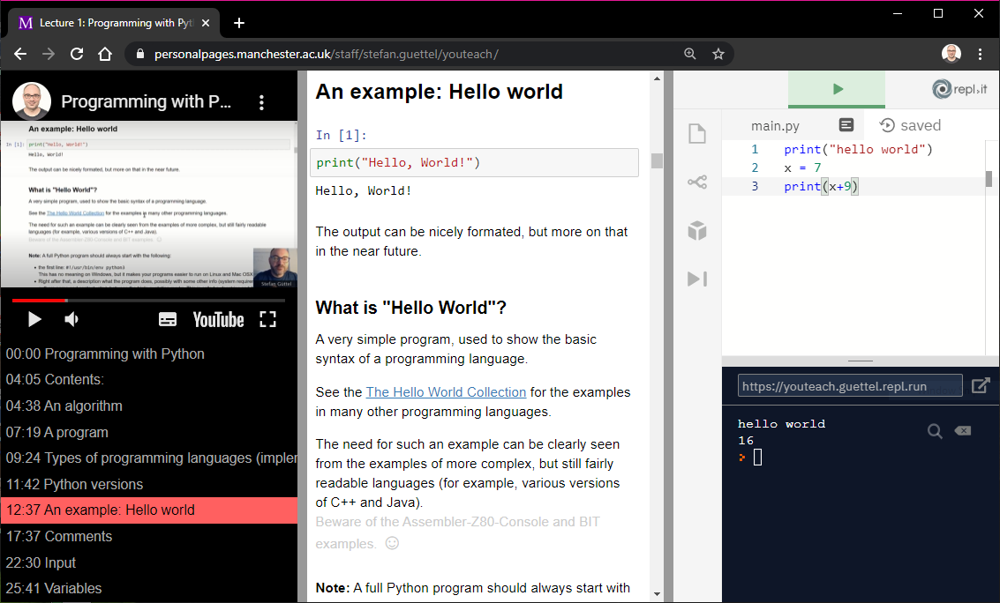

# YouTeach.js

**youteach.js** is a simple tool to synchronise YouTube videos and Jupyter Notebooks in the browser. It also supports integration of the repl.it code editor.

It has been built to support blended learning for a Python programming course, but can be used for other courses as well. The only requirement is that the lecture notes are available in HTML format and navigatable with anchor links. A main benefit is that students can copy and paste the codes discussed in the video either to their local IDE or run them directly in the browser using repl.it.

[**View an example lecture**](https://personalpages.manchester.ac.uk/staff/stefan.guettel/youteach/)

## Setup

**youteach.js** is written in JavaScript and easy to set up. Simply follow the below steps:

**1.** On your webserver, create a new folder.

**2.** In this web folder, place your Jupyter notebook file as an HTML export. (In Jupter, view the notebook and go to File -> Download as -> html to produce this HTML file.)

**3.** In that same web folder, place the files `index.html` and `custom.css` from the repository. You should now be able to view `index.html` showing the example lecture.

**4.** Open `index.html` in a text editor and modify lines 11-37 as follows:
   * line 11: change this to the title of your lecture
   * line 13: change the value of `notebookUrl` to the name of the exported HTML file
   * line 14: change the value of `replitUrl` to the URL of a shared repl.it editor
   * line 15: change the value of `ytVideoId` to the id of your YouTube lecture video
   
     *Example:* If your video URL is https://www.youtube.com/watch?v=yZH74R58h40, then the id is `yZH74R58h40`
     
   * line 16ff: change the timestamps and anchor names in `tslist` so that they coincide with the timings in the YouTube video and the anchors in the HTML file. In order to obtain the anchors, simply hover over a heading in the HTML file and read off the URL part following the `#` symbol.
   
     *Example:* If the URL points to `https://{some domain}/example-notebook.html#Python-versions` and the corresponding timestamp in the YouTube video is `11:42`, then the entry in `tslist` should be `'11:42 Python-versions'`.

## Feedback

I hope you find **youteach.js** useful for your purposes. If so, I'd be keen to know and would appreciate any feedback: stefan.guettel@manchester.ac.uk

## Acknowledgements

Thanks to the teams at YouTube, jQuery, and repl.it, as well as Rick Strahl for the jQuery Resizable plugin. Thanks also to many students who have given useful feedback.
